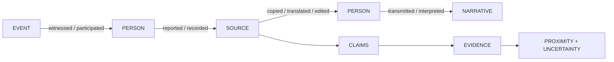

<div align="center">

# SUPERHERO

## ACTOR & TRANSMISSION INTELLIGENCE

### **TRACE THE PERSON.**

#### IDENTITY · WITNESSING · AUTHORSHIP · TRANSMISSION

A provenance-first repository for reconstructing **human agency, authorship, witnessing, transmission, interpretation, and narrative chain of custody** across MoonWitness / Rocksoul Research.

**MOONWITNESS · ROCKSOUL RESEARCH · STORY × EVENT × PERSON × TEXT × LAW**

<br/>

[](https://github.com/bjo163/rocksoul-superhero/actions/workflows/validate.yml)


<br/>

[Architecture](#narrative-chain-of-custody) · [Canonical chain](#first-canonical-transmission-chain) · [Shared proof](#four-way-proof-case) · [Repository map](#repository-atlas)

</div>

---

> **SUPERHERO is a brand, not a verdict. A person is not automatically classified as a hero, villain, saint, martyr, or savior. Those are source-relative narrative attributions.**

A witness is not automatically a perfect witness.  
An author is not automatically the originator.  
A recorder is not automatically neutral.  
A translator is not automatically an author.  
A famous role is not the same thing as historical identity.

That separation is the foundation of SUPERHERO.

## Core question

```text
WHO was involved?
WHEN were they active?
HOW close were they to the event?
WHAT did they witness / write / transmit?
WHICH source supports that relation?
WHAT changed between one actor and the next?
```

## Narrative chain of custody



A gap in the chain is itself data.

<div align="center">

### **IDENTITY ≠ ROLE · WITNESS ≠ PERFECT WITNESS**

</div>

## MoonWitness / Rocksoul research map

| Repository | Domain | Core question | Mantra |
|---|---|---|---|
| [`rocksoul-mftl`](https://github.com/bjo163/rocksoul-mftl) | STORY | What was told? | TRACE THE STORY. |
| [`rocksoul-legend`](https://github.com/bjo163/rocksoul-legend) | EVENT | What happened? | TRACE THE EVENT. |
| **`rocksoul-superhero`** | PERSON | Who was involved? | TRACE THE PERSON. |
| [`rocksoul-rgbl`](https://github.com/bjo163/rocksoul-rgbl) | TEXT | What does the exact text say? | TRACE THE TEXT. |
| [`rocksoul-aws`](https://github.com/bjo163/rocksoul-aws) | LAW | Was it allowed? | TRACE THE LAW. |

```text
STORY   → MFTL
EVENT   → LEGEND
PERSON  → SUPERHERO
TEXT    → RGBL
LAW     → AWS
```

**SUPERHERO owns canonical PERSON / actor / transmission records.** It contributes human proximity and chain-of-custody evidence without inheriting ownership of events, narratives, exact scripture text, or legal conclusions.

## Golden rules

**IDENTITY ≠ ROLE.**  
**AUTHOR ≠ ORIGINATOR.**  
**WITNESS ≠ PERFECT WITNESS.**  
**RECORDED ≠ INVENTED.**  
**TRANSLATED ≠ AUTHORED.**  
**LATER COMPILER ≠ CONTEMPORARY SOURCE.**  
**PORTRAYED AS HERO ≠ OBJECTIVELY HERO.**  
**UNCERTAINTY IS DATA.**

## Four-way proof case

### **CASE 001 — JERUSALEM 70 CE**

`PER-JERUSALEM-FLAVIUS-JOSEPHUS`

```text
RGBL      Mark 13:2 exact text
MFTL      prediction narrative
LEGEND    70 CE destruction event
SUPERHERO Josephus — direct witness / recorder
```

SUPERHERO contributes **human proximity and chain of custody**. Josephus's presence strengthens documentary provenance; it does not turn his interpretations into automatic fact and does not prove a theological reading of Mark 13:2.

[Read the shared case →](docs/cases/JERUSALEM-70-TEMPLE.md)

## First canonical transmission chain

### `PER-COL-JUAN-RODRIGUEZ-FREYLE`

**Juan Rodríguez Freyle — later compiler / recorder**

```text
LEGEND
EVT-COL-GUATAVITA-OFFERINGS
        ↓
later colonial interpretation
        ↓
JUAN RODRÍGUEZ FREYLE
        ↓ authored
EL CARNERO
        ↓ recorded / transmitted
MFTL
CAND-COL-MUISCA-EL-DORADO-GUATAVITA-000001
```

The chain preserves a crucial distinction:

```text
RECORDED VERSION       ✅
NAMED INFORMANT CLAIM  ✅
DIRECT WITNESS         ❌
ORIGINATOR             NOT ESTABLISHED
```

Freyle states that **don Juan, cacique of Guatavita**, told him the relevant traditions. SUPERHERO preserves that as a documented informant claim without prematurely creating a second canonical person.

## Current graph

```text
2 canonical people
7 local sources
9 atomic claims
9 evidence edges
6 actor relationships
16 relation types
```

Semantic validation enforces local graph integrity and qualified cross-repository references such as:

```text
legend:EVT-COL-GUATAVITA-OFFERINGS
mftl:CAND-COL-MUISCA-EL-DORADO-GUATAVITA-000001
```

## Foundation boundary

SUPERHERO deliberately keeps the foundation bounded:

- person identity + uncertainty;
- actor-to-event/source/narrative relationships;
- temporal proximity;
- local claims + evidence;
- cross-repository references;
- semantic graph validation;
- complete transmission chains as proof cases.

No hero ranking, psychology profiling, or moral scoring is implied by the repository name.

## Repository atlas

```text
rocksoul-superhero/
├── data/            people, claims, evidence, actor relations
├── docs/            method, cases, interoperability
├── schemas/         machine-valid person/transmission contracts
├── scripts/         validation and graph checks
└── .github/         CI and repository automation
```

---

<div align="center">

## **TRACE THE PERSON.**

### **IDENTITY · PROXIMITY · SOURCE · TRANSMISSION · UNCERTAINTY**

**Follow the human chain without turning attribution into verdict.**

`SUPERHERO / MoonWitness · Rocksoul Research`

</div>
